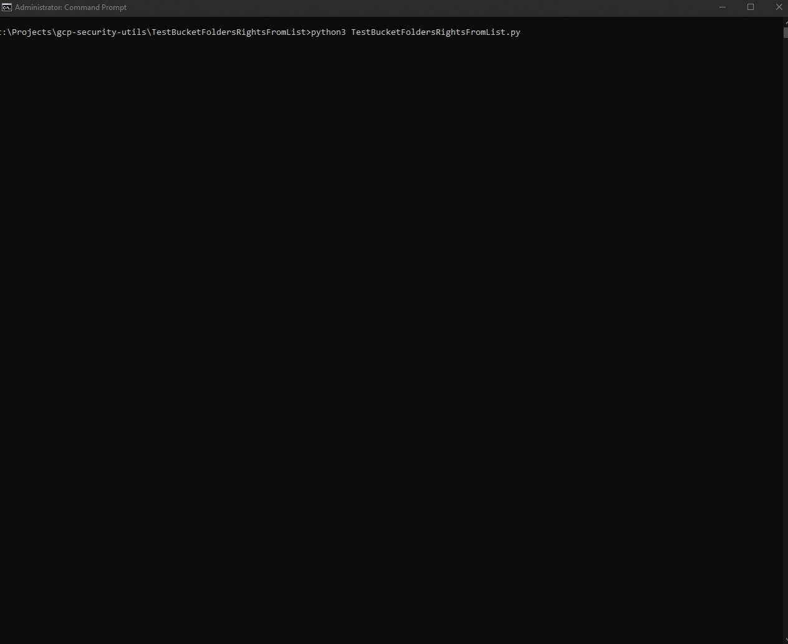

# TestBucketFoldersRightsFromList

## Description:
### Program receives a list of bucket folders, will try to write into each and if writing was successful then it will try to delete the previously written file, providing output to the user and writing to output file at the end.
### To gather the bucket subfolders manually you can do:
### Windows ' gsutil ls -r gs://demo-bucket-one/** | Select-String -pattern "/$" >> FoldersList.txt'
### Linux ' gsutil ls -r gs://demo-bucket-one/** | grep -e "/$" >> FoldersList.txt'
### Note that above commands will put only subfolders to FoldersList.txt, you will have to add root folders/buckets manually.
### Things to be taken into account:
### 1. If write was successful, but deletion wasn't, you will have to clean up the files by hand from google cloud console or gsutil.
### 2. If file is already inside the bucket folder, and you don't have deletion rights, the write test will not work properly (You will receive a [?] warning).
### 3. If couldn't write, then deletion test will not happen.
### Requirements: gsutil, being authenticated with gsutil
### Arguments: 
### -iF (or --bucketfolderslist) pathToInputFile (containing buckets separated by new lines) [Default is "FoldersList.txt"]
### -tF (or --testfile) pathToTestFile (file to upload) [Default is "testfile"]
## To run simply execute the script.
### Example 1: python3 TestBucketFoldersRightsFromList.py
### Example 2: python3 TestBucketFoldersRightsFromList.py -iF C:\Users\BauBau\Documents\FoldersToTest.txt -tF C:\Users\BauBau\Documents\myCustomTestFile.txt
## Output files will be generated inside the output folder once script finishes.

## Demo

